There have been many people and resources that I have learned from over the years, and I constantly seek out people and resources to learn and improve from. While I wasn't able to play at the collegiate level, I've had the opportunity to coach alongside, observe, and learn from others that have played at a higher level of college or professional ball. In addition to this experience, below is a selection of some of the resources that I have found useful to reference and learn from.

## Books

| Book | Title &amp; Author | Notes |
|:---:|---|---|
| 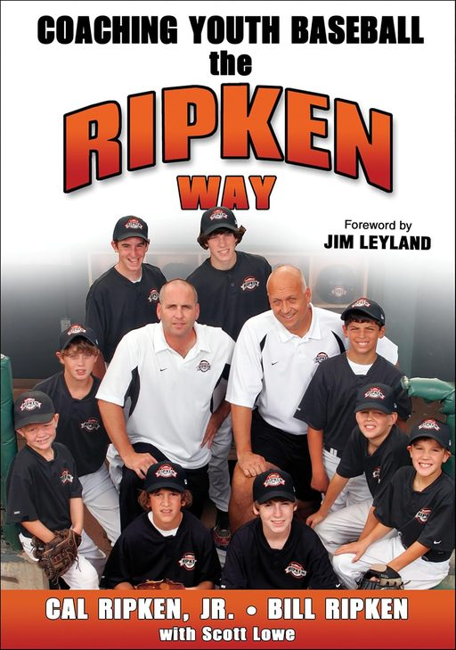 | [Coaching Youth Baseball the Ripken Way](https://a.co/d/gRfsk8s) Cal Ripken, Jr, Bill Ripken | As my childhood sports hero, the Ripken’s teach the fundamentals of baseball the same way they played. |
| 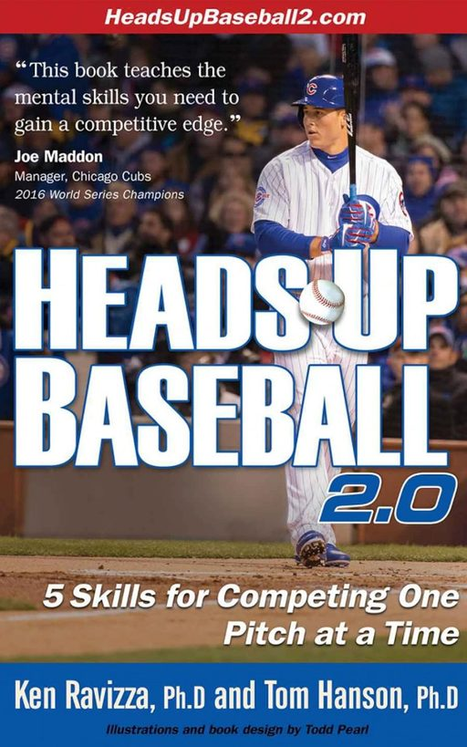 | [Heads Up Baseball 2.0](https://a.co/d/bE7cJgI) Ken Ravizza, Tom Hanson | Outstanding book on mental strategies to compete one pitch at a time. |
| 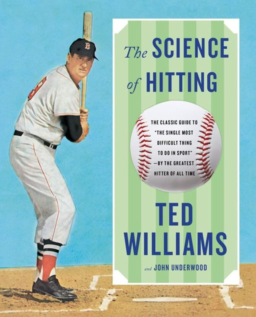 | [The Science of Hitting](https://a.co/d/byVZejH) Ted Williams | Learning from one of the greatest hitters of all time. |
| 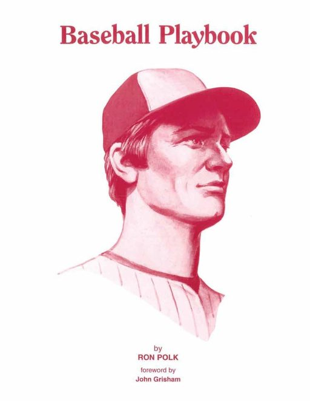 | [Baseball Playbook](https://a.co/d/eezzGId) Ron Polk | Thorough playbook from an accomplished college coach. |
| 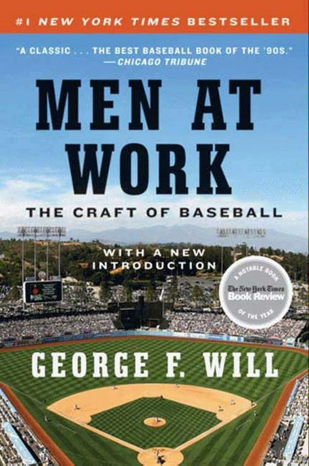 | [Men at Work](https://a.co/d/cBQr3z3) George Will | Insights into some of the great figures of the game. |
| 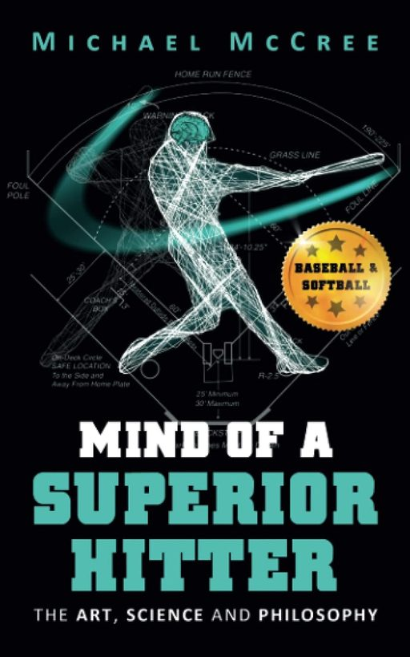 | [Mind of a Superior Hitter: The Art, Science and Philosophy](https://a.co/d/931fvHp) Michael McCree |  |
| 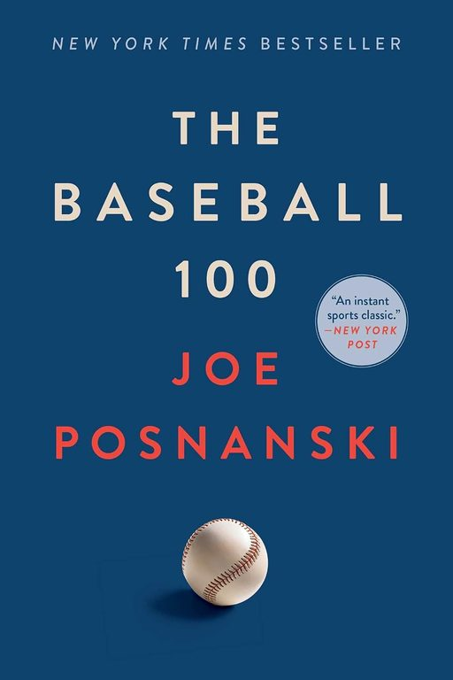 | [The Baseball 100](https://a.co/d/9xjObcG) Joe Posnanski |  |
| 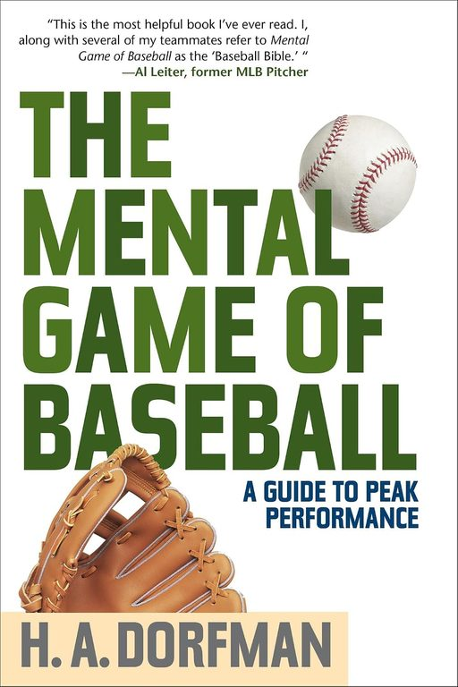 | [The Mental Game of Baseball](https://a.co/d/6jJh0VY) H.A. Dorfman |  |
| 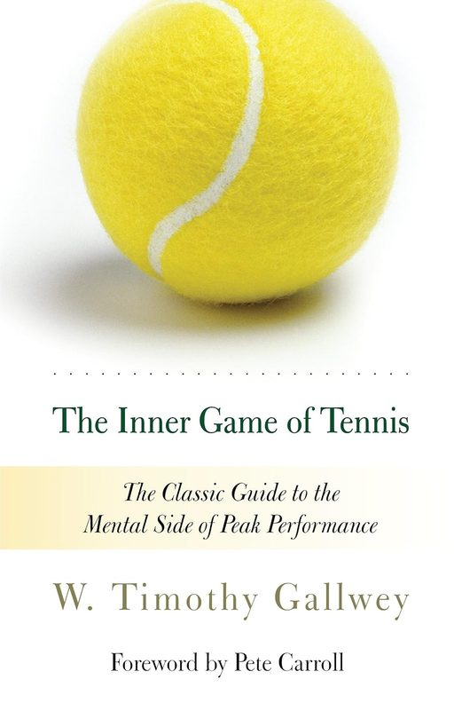 | [The Inner Game of Tennis](https://a.co/d/7Bq28XE) W. Timothy Gallwey | A tennis book? An excellent read for the mental game of any sport. |
| 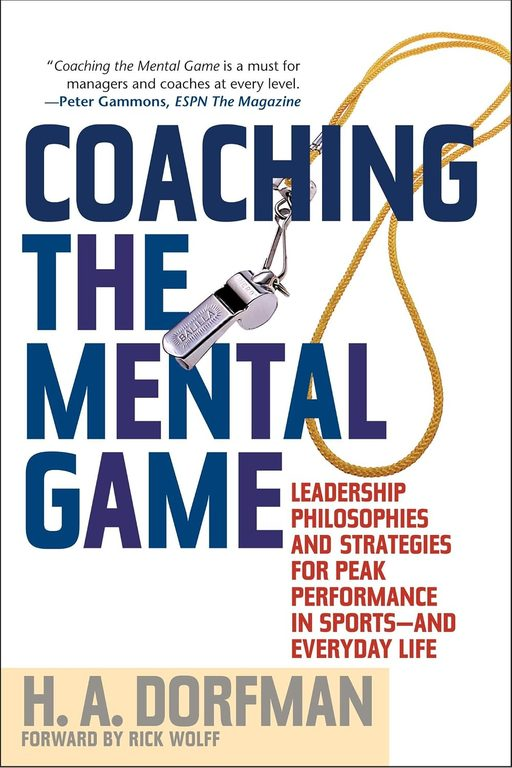 | [Coaching the Mental Game](https://a.co/d/9Ma7yqx) H.A. Dorfman |  |

## Podcasts

| | |
|:---:|---|
| 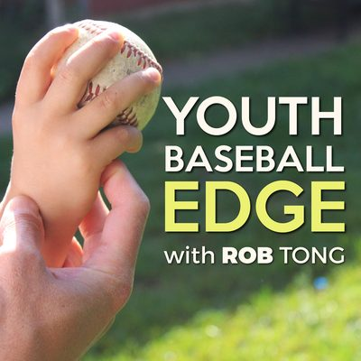 | Youth Baseball Edge with Rob Tong [youthbaseballedge.com](https://www.youthbaseballedge.com/) · [podcasts](https://www.youthbaseballedge.com/podcasts/) |
| 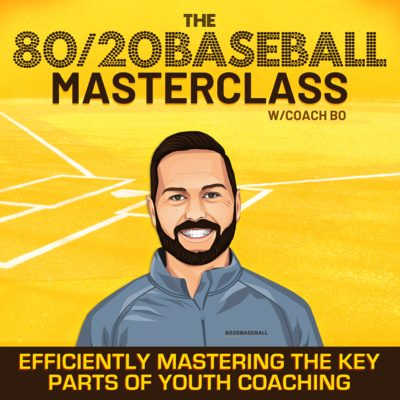 | 80/20 Baseball with Coach Bo [8020baseball.com](https://www.8020baseball.com/) · [listen](https://podcasters.spotify.com/pod/show/8020baseball) |

## Websites

- [Fellowship of Christian Athletes (fca.org)](https://www.fca.org/home)
  - [The Coach's Mandate (fca.org)](https://www.fca.org/resources/the-coachs-mandate)
- [How To Coach The Mental Game (headsupbaseball2.com)](https://headsupbaseball2.com/blog/coach)

## YouTube Channels and Videos

- [My Baseball Playlist](https://youtube.com/playlist?list=PLWO4cWxilfc7TtHbVi3VWRHwmJGl9E_4r)

  <iframe style="position:absolute;top:0;left:0;width:100%;height:100%;border:0;"
    src="https://www.youtube.com/embed/videoseries?list=PLWO4cWxilfc7TtHbVi3VWRHwmJGl9E_4r"
    title="Baseball Training" loading="lazy" allowfullscreen
    allow="accelerometer; autoplay; clipboard-write; encrypted-media; gyroscope; picture-in-picture; web-share"
    referrerpolicy="strict-origin-when-cross-origin"></iframe>

